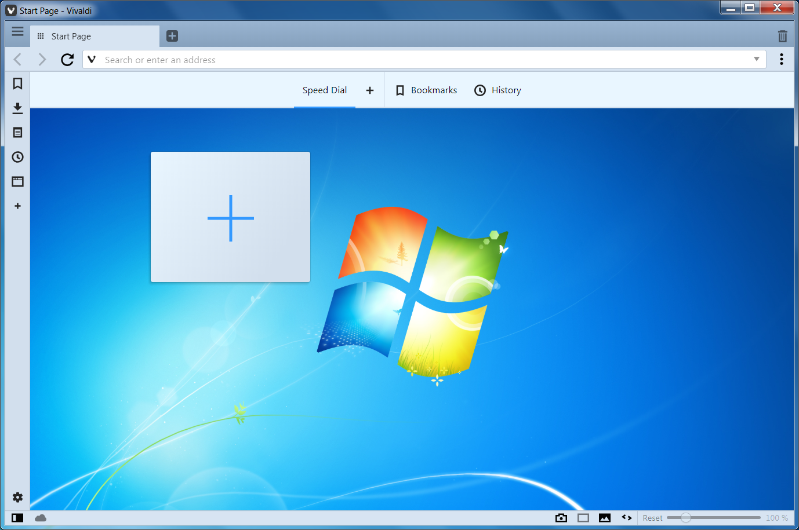

# Windows 7

A native-ish theme for [Vivaldi](https://vivaldi.com)

## Theme settings

* Colors
  * Background: `#d7e4f2`
  * Foreground: `#000000`
  * Highlight: `#3399ff`
  * Accent: `#99b4d1`
* Preferences
  * Accent Color from Active Page: `[ ]`
  * Apply Accent Color to Windows: `[✓]`
  * Transparent Tabs: `[✓]`
* Corner Roudning: `3px`

You can download this theme in [JSON](windows-7.json), which is compatible with [luetage](https://github.com/luetage)'s [import/export mod](https://forum.vivaldi.net/topic/33154/import-and-export-themes).
